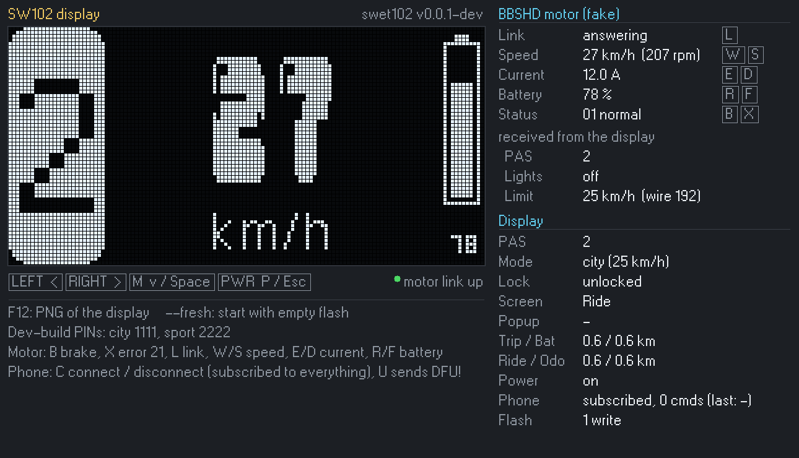

# Swet102

Opinionated firmware for the Bafang **SW102** handlebar display, built for one
e-bike: **PET** (Personal Electrical Transport). SW102 + PET = Swet102.

- [`docs/PRODUCT.md`](docs/PRODUCT.md) — what it does
- [`docs/TECH_DESIGN.md`](docs/TECH_DESIGN.md) — how it's built

**Status:** v0.1.0, the first daily-use release (M6): riding screen with PAS,
Lights, Player and Gate pages, motor bus, error screens, saved settings, lock
with city/sport PINs, auto power-off, trips with max/avg/Ah, battery-trip
message, menu, BLE (telemetry, trips, phone commands, DFU from the phone), boot
animation, page slides, PAS roll and info-pane slide. The phone side is [swet102-app](https://github.com/OmoYauhen/swet102-app).


## Layout

| Path | What |
|---|---|
| `crates/swet-heart` | `no_std` Rust core: all logic, hardware behind `trait Hal` |
| `crates/swet-fw` | staticlib for the nRF51: `Hal` over FFI, `swet_init` / `swet_tick` |
| `crates/swet-sim` | simulator: virtual clock, fake motor, golden-frame tests |
| `crates/swet-emu` | desktop emulator window |
| `crates/swet-assets` | font/image generator: `assets/*.xbm` → `swet-heart/src/gfx/assets.rs` |
| `platform/nrf51` | C: main loop, SH1107, UART, SoftDevice glue (nRF5 SDK 12.3 + S130) |

## Build

Everything runs inside the Nix dev shell:

```sh
nix develop
cargo test                 # core + simulator tests
cargo run -p swet-emu      # emulator, keys below
make                       # build/swet102.hex
make check                 # size gates
```

`nix flake check` runs what CI runs.

### Emulator



The display on the left; on the right the fake BBSHD controller (with what it
has received from the display: PAS, lights, speed limit) and the display's
state. Button and key chips light up while held.

| Key | Does |
|---|---|
| ← → | LEFT / RIGHT |
| ↓ or Space | M |
| P or Esc | PWR |
| W / S | motor speed ± 1 km/h |
| E / D | motor current ± 1 A |
| R / F | battery ± 5 % |
| B | braking on / off (status 03) |
| X | motor error 21 on / off |
| L | motor link on / off |
| C | phone connected + subscribed / gone |
| U | the phone writes `DFU!` (needs a phone, wheel stopped 5 s) |
| F11 | GIF of the display: start / stop (`swet102-NNN.gif`, real timing) |
| F12 | PNG of the display |

`--fresh` starts with empty flash (otherwise `emu-store.bin` is reused);
`--snapshot=FILE.png` renders a short scripted ride to a PNG without a window;
`--gif=FILE.gif` records the scripted tour above (`docs/demo.gif`). The window
starts with the boot animation, like the bike.

## Using it

The tile on the left is the **page**; LEFT / RIGHT act on it. M click goes to
the next page (PAS → Lights → Player → Gate), PWR click jumps back to PAS.

| Page | LEFT | RIGHT |
|---|---|---|
| PAS (number) | PAS − (hold at 0: walk assist, tile shows ↑) | PAS + (0–9) |
| Lights (bulb) | lights off | lights on; the screen dims while they're on |
| Player (note) | click: volume −, hold: previous track | click: volume +, hold: next track, double-click: play / pause |
| Gate (key) | gate A | gate B |

Player and Gate send commands to the phone over BLE. Without a phone subscribed
to commands their glyph is dithered and LEFT / RIGHT do nothing.

| Gesture | Does |
|---|---|
| M click | next page |
| PWR click | back to the PAS page |
| M double-click | next info view: speed → power → TRIP → BAT → RIDE → ODO |
| M hold | menu (below) |
| PWR hold | power off (settings are saved first) |
| PWR double-click | **lock**: padlock, then off. The next power-on asks for a PIN |
| PIN screen: LEFT / RIGHT, M, PWR | change the digit, next digit, back one digit |
| M on the error screen | dismiss it (it returns after 10 s if the fault is still there) |

The **city PIN** unlocks with a 25 km/h limit, the **sport PIN** with 99 km/h
(a lightning bolt in the battery icon). PAS, mode and lock survive power-off;
the display switches itself off after 5 minutes without movement, motor current
or buttons.

## Bluetooth

The display advertises as `swet102` for as long as it's on (fast for 30 s after
power-on or a disconnect, then once a second). Phones connect without pairing.
The GATT service (`8f030001-da4c-453d-a163-41a592a0e9fd`) has telemetry (1 Hz),
trips (every 5 s), commands (one notification per Player/Gate press) and a
control characteristic: writing `DFU!` reboots into the bootloader once the
wheel has stood still for 5 s. Byte layouts: TECH_DESIGN §9.4.

There's no phone app yet. `tools/ble-phone.py` stands in for it from a PC with
Bluetooth: it connects, subscribes to everything and prints what the display
sends (`--dfu` also writes `DFU!`).

## Flashing

The display keeps casainho's bootloader and S130. Firmware updates need a
**`VERSION_NUM` higher than the installed one** (the bootloader refuses
downgrades); `version.mk` makes it date-based.

```sh
SWET_PIN_CITY=xxxx SWET_PIN_SPORT=yyyy make release   # check + build/swet102-<VERSION_NUM>.zip → nRF Toolbox → DFU
make flash-app  # over SWD (WCH-LinkE in DAP mode), keeps bootloader + S130
```

After an OTA update the bootloader keeps advertising `SW102_DFU` until you
**power off and start the display with a long PWR press**.

**PINs** are built into the firmware from `SWET_PIN_CITY` and `SWET_PIN_SPORT`
(4 digits each, different). They are never stored in the repo. Without them
(tests, emulator, CI) the public dev PINs **1111 / 2222** are used and the version
shows `-dev`; `make dfu` refuses that unless you add `DEV_PINS=1` for a bench build.

`tools/nrfutil.sh` and `tools/openocd.sh` run nrfutil 6.1.7 and OpenOCD in Docker
(nrfutil needs Python < 3.11; raw USB needs root on NixOS).

### Before relying on a release

The hardware checks from TECH_DESIGN §16 that the emulator can't answer:

- [ ] **City limit:** bike on a stand in city mode, assist must cut out at 25 km/h
  (if it's ~32, flip `SPEED_LIMIT_AS_RPM` in `config.rs`).
- [ ] **Walk assist:** hold it for 30 s; if the motor stops after a while, set
  `WALK_KEEPALIVE_MS`.
- [ ] **Menu → Update** and `tools/ble-phone.py --dfu` both bring up `SW102_DFU`.
- [ ] **BLE:** the display boots with the GATT service, the app (or
  `tools/ble-phone.py`) gets telemetry, Player and Gate presses arrive.
- [ ] **Lights** switch the motor light and dim the screen.
- [ ] Diagnostics screen: `TICK US` average stays well under 20 000 while pages and
  panes slide (late frames only skip, but smooth slides need the headroom).
- [ ] A smoke ride, then `git tag v0.1.0`.

## Menu (M hold)

LEFT / RIGHT flip through the items (it wraps), M opens one, PWR goes back.

| Item | Does |
|---|---|
| Reset trip | zeroes the manual trip (asks first) |
| Bluetooth | phone connected?, commands on?, the display's BLE address, commands sent / notifications dropped |
| Diagnostics | the screen below |
| Firmware | version, build number (`VERSION_NUM`), git commit, and a QR code to this repo |
| Update (DFU) | saves, then reboots into the bootloader's DFU mode (asks first) |

**Trips:** TRIP resets from the menu, BAT resets itself when the battery goes up
by 10 % or more (and shows how far the last charge went), RIDE starts at 0 on
every power-on. Each shows distance, max and average speed (average over moving
time only) and the charge used in Ah; ODO shows the total and the all-time max.

## Diagnostics screen (menu → Diagnostics)

| Shows | Meaning |
|---|---|
| `TICK US avg/max`, `MISS` | time spent in one `swet_tick()`, late ticks |
| `STACK FREE` | bytes of the 4 KB stack never touched |
| `RAM nK`, `SD BASE` | RAM size from FICR, lowest RAM start the SoftDevice accepts |
| `MOT REQ / OK / WR`, `TMO / CHK / STRAY` | motor bus: requests, valid replies, writes, timeouts, bad checksums, stray bytes |
| L R M P boxes | live button state |
| `LCD US avg/max` | time of one display flush |
| `SAVE`, `SERR` | settings saves since power-on, failed flash writes |

## License

GPL-3.0. Some low-level code is adapted from
[Swang Stodva](https://github.com/OmoYauhen/swang-stodva) and casainho's SW102 firmware.

Fonts: 04B_30 digits (via Swang Stodva); **W95FA** by FontsArena, SIL Open Font
License 1.1 (`assets/fonts/W95FA-OFL.txt`).
